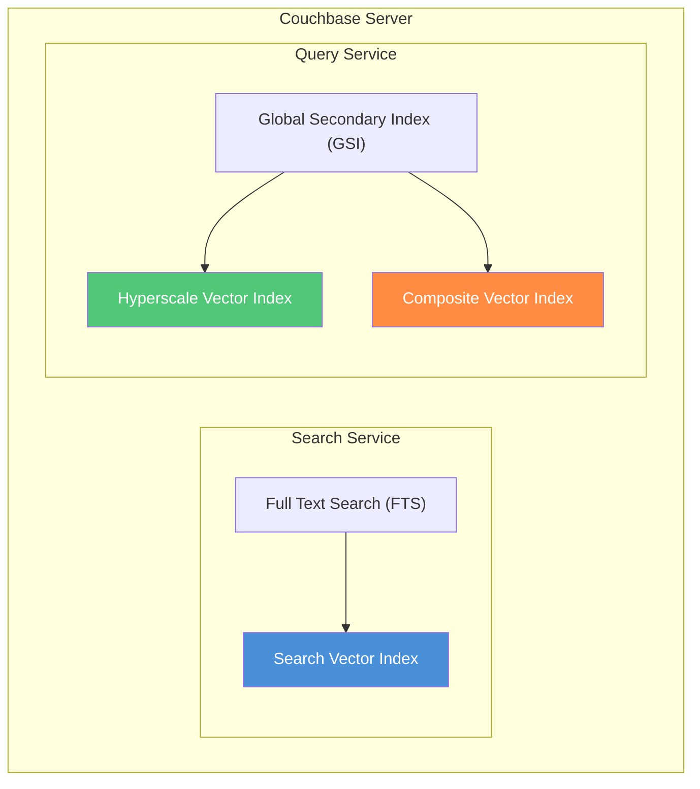
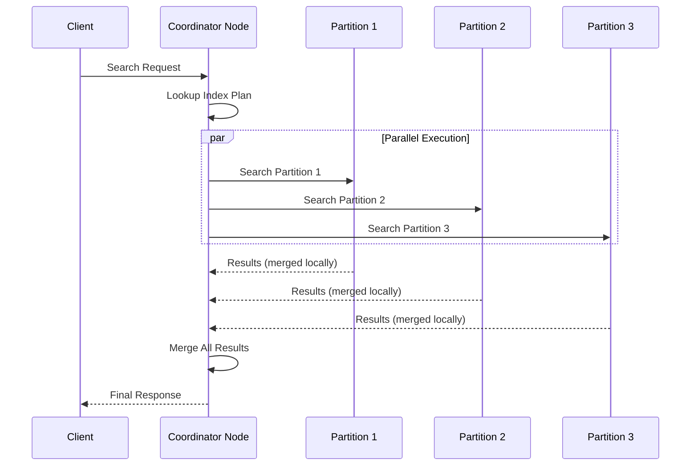
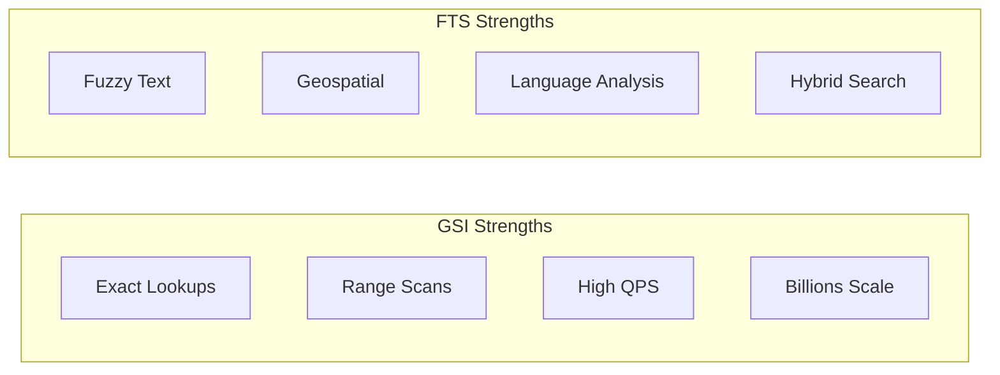
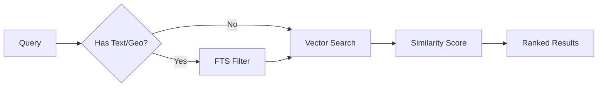
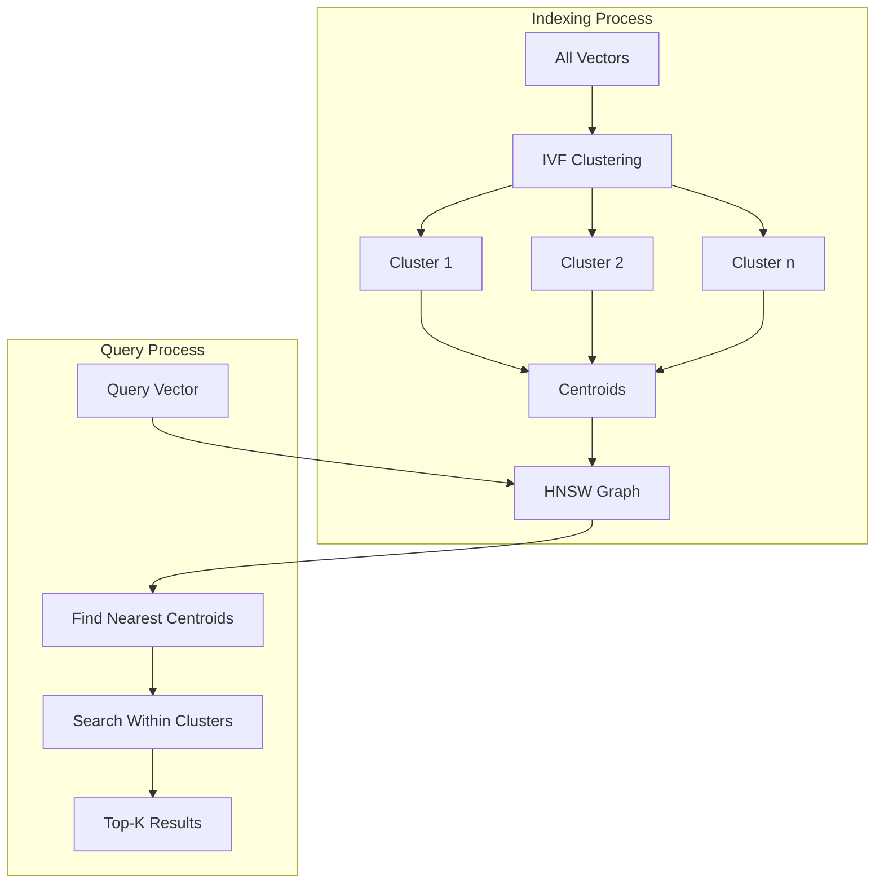
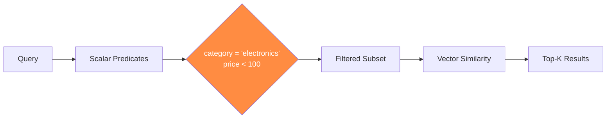
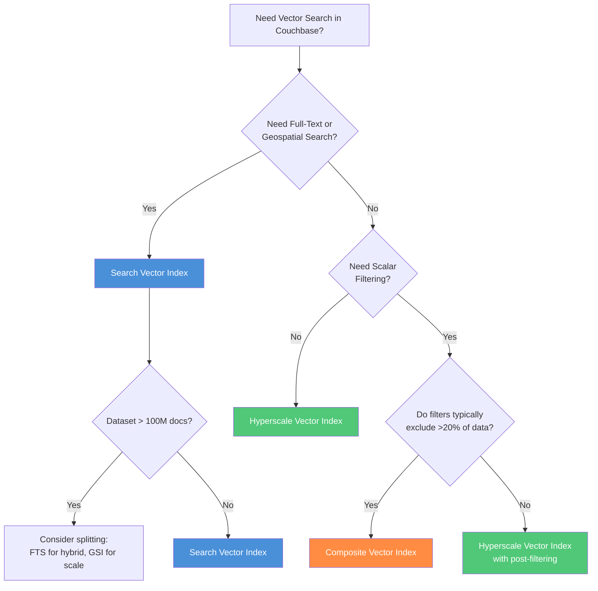

# Couchbase Vector Index Guide

A comprehensive guide to understanding Couchbase's vector search capabilities, index types, and when to use each.

---

## Table of Contents

1. [Introduction](#introduction)
2. [Core Services Overview](#core-services-overview)
3. [Full Text Search (FTS) Service](#full-text-search-fts-service)
4. [Global Secondary Index (GSI) Service](#global-secondary-index-gsi-service)
5. [Vector Index Types](#vector-index-types)
   - [Search Vector Index](#search-vector-index)
   - [Hyperscale Vector Index](#hyperscale-vector-index)
   - [Composite Vector Index](#composite-vector-index)
6. [Comparison Table](#comparison-table)
7. [Choosing the Right Index](#choosing-the-right-index)
8. [Terminology in This Cookbook](#terminology-in-this-cookbook)
9. [Sources](#sources)

---

## Introduction

### What is Vector Search?

Vector search enables AI applications to find semantically similar content by comparing mathematical representations (embeddings) of data. Instead of matching exact keywords, vector search understands the *meaning* behind queries.

**Common Use Cases:**
- **RAG (Retrieval-Augmented Generation)**: Providing relevant context to LLMs
- **Semantic Search**: Finding documents by meaning, not just keywords
- **Recommendation Systems**: Suggesting similar products, content, or users
- **Image/Audio Search**: Finding similar media based on visual or audio features
- **Anomaly Detection**: Identifying outliers in IoT sensor data

### Couchbase Vector Search Evolution

```
Timeline:
┌─────────────────────────────────────────────────────────────────────┐
│ Couchbase 7.6 (2024)         │ Couchbase 8.0 (2025)                │
│ ─────────────────────        │ ─────────────────────               │
│ Search Vector Index          │ + Hyperscale Vector Index           │
│ (FTS-based)                  │ + Composite Vector Index            │
│ Millions of vectors          │   (GSI-based)                       │
│                              │   Billions of vectors               │
└─────────────────────────────────────────────────────────────────────┘
```

---

## Core Services Overview

Couchbase provides vector search through two distinct services, each hosting different index types:



| Service | Primary Purpose | Vector Index Types | Version |
|---------|----------------|-------------------|---------|
| **Search Service (FTS)** | Text search, geospatial | Search Vector Index | 7.6+ |
| **Query Service (GSI)** | SQL++ queries, fast lookups | Hyperscale, Composite | 8.0+ |

---

## Full Text Search (FTS) Service

### What is FTS?

The Full Text Search service provides Google-like search capabilities powered by [Bleve](https://blevesearch.com/), an open-source search library written in Go. It enables natural language queries with relevancy scoring.

### Key Capabilities

- **Language-Aware Search**: Finds variations like "travel", "traveling", "traveler"
- **Fuzzy Matching**: Handles typos and misspellings
- **Geospatial Queries**: Search by location, radius, bounding box
- **Boolean Queries**: Complex AND/OR/NOT combinations
- **Numeric Range**: Filter by price, date, quantity
- **Relevancy Scoring**: Results ranked by match quality

### Distributed Architecture



### Role in Vector Search

FTS hosts the **Search Vector Index**, enabling hybrid searches that combine:
- Vector similarity (semantic search)
- Full-text search (keyword matching)
- Geospatial queries (location-based filtering)

---

## Global Secondary Index (GSI) Service

### What is GSI?

The Global Secondary Index service uses B-tree data structures optimized for fast exact lookups and range scans. It powers SQL++ (N1QL) queries and provides the foundation for high-performance vector search in Couchbase 8.0+.

### Key Characteristics

| Aspect | Description |
|--------|-------------|
| **Data Structure** | B-tree for fast exact search |
| **Query Language** | SQL++ (N1QL) |
| **Strengths** | Range scans, pattern matching, high throughput |
| **Partitioning** | Distributed across cluster nodes |

### GSI vs FTS Comparison



### Role in Vector Search

GSI hosts two vector index types:
- **Hyperscale Vector Index**: Pure vector similarity at massive scale
- **Composite Vector Index**: Vector + scalar pre-filtering

---

## Vector Index Types

### Search Vector Index

The Search Vector Index combines the FTS service with vector similarity search, enabling hybrid queries.

#### Architecture

```
┌─────────────────────────────────────────────────┐
│            Search Vector Index                  │
├─────────────────────────────────────────────────┤
│  ┌─────────────┐  ┌─────────────┐  ┌─────────┐ │
│  │ Text Index  │  │ Geo Index   │  │ Vector  │ │
│  │ (Inverted)  │  │ (R-tree)    │  │ Column  │ │
│  └─────────────┘  └─────────────┘  └─────────┘ │
├─────────────────────────────────────────────────┤
│           Search Service (FTS)                  │
└─────────────────────────────────────────────────┘
```

#### Specifications

| Property | Value |
|----------|-------|
| **Scale** | ~100 million documents |
| **Service** | Search Service (FTS) |
| **Version** | Couchbase 7.6+ |
| **Indexing Algorithm** | IVF (automatic for >1000 vectors) |
| **Quantization** | Automatic 8-bit SQ (for >10K vectors) |
| **PQ Support** | No |

#### Best Use Cases

- **E-commerce Product Search**: "Show me red dresses similar to this image under $50"
- **Travel Recommendations**: "Hotels near downtown similar to my favorites"
- **Real Estate**: "Houses with 3+ bedrooms that look like this floor plan"
- **Media Libraries**: "Articles about AI that mention 'machine learning'"

#### Query Flow



#### Example Query (Hybrid)

```sql
SELECT META().id, title, score
FROM `bucket`
USE INDEX (my_search_vector_index USING FTS)
WHERE SEARCH(
  bucket,
  {
    "query": {"match": "machine learning"},
    "knn": [{
      "field": "embedding",
      "vector": [0.1, 0.2, ...],
      "k": 10
    }]
  }
)
ORDER BY score DESC
```

---

### Hyperscale Vector Index

The Hyperscale Vector Index is designed for pure vector similarity search at massive scale, optimized for disk-based storage.

#### Architecture

```
┌─────────────────────────────────────────────────┐
│          Hyperscale Vector Index                │
├─────────────────────────────────────────────────┤
│  ┌─────────────────────────────────────────┐   │
│  │     Single Vector Column                │   │
│  │     (float32[] or BASE64)               │   │
│  └─────────────────────────────────────────┘   │
│  ┌─────────────────────────────────────────┐   │
│  │     IVF Clusters + HNSW Centroids       │   │
│  └─────────────────────────────────────────┘   │
│  ┌─────────────────────────────────────────┐   │
│  │     Disk-Optimized Storage              │   │
│  └─────────────────────────────────────────┘   │
├─────────────────────────────────────────────────┤
│           Query Service (GSI)                   │
└─────────────────────────────────────────────────┘
```

#### Specifications

| Property | Value |
|----------|-------|
| **Scale** | Billions of documents |
| **Service** | Query Service (GSI) |
| **Version** | Couchbase 8.0+ |
| **Indexing Algorithm** | IVF + HNSW (for centroids) |
| **Quantization Options** | SQ4, SQ6, SQ8 (default), PQnxb |
| **Memory Footprint** | Low (disk-optimized) |
| **Concurrent Updates** | Excellent |

#### Indexing: IVF + HNSW



**How IVF Works:**
1. Divide vector space into clusters (centroids = vector_count / 1000)
2. Build HNSW graph on centroids for fast centroid lookup
3. At query time, find nearest centroids, then search within those clusters

#### Quantization Methods

| Method | Bits/Dimension | Memory Reduction | Accuracy |
|--------|---------------|------------------|----------|
| **SQ8** (default) | 8 | 4x | Highest |
| **SQ6** | 6 | 5.3x | High |
| **SQ4** | 4 | 8x | Good |
| **PQ** (Product) | Configurable | 10-50x | Variable |

#### Similarity Metrics

- **Euclidean** (L2): Standard distance
- **Euclidean Squared**: Faster, equivalent ranking
- **Cosine**: Angle-based similarity (normalized vectors)
- **Dot Product**: For pre-normalized embeddings

#### Best Use Cases

- **RAG Pipelines**: Retrieve context for LLMs at scale
- **Content Discovery**: Find similar articles, products, videos
- **Recommendation Engines**: User-item similarity matching
- **Anomaly Detection**: Identify unusual patterns in IoT data
- **Image Search**: Reverse image lookup in large collections

#### Example Query

```sql
SELECT META().id, title
FROM `bucket`
WHERE embedding <-> $query_vector
ORDER BY embedding <-> $query_vector
LIMIT 10
```

---

### Composite Vector Index

The Composite Vector Index combines GSI scalar columns with vector search, applying scalar filters *before* vector similarity.

#### Architecture

```
┌─────────────────────────────────────────────────┐
│          Composite Vector Index                 │
├─────────────────────────────────────────────────┤
│  ┌───────────┐  ┌───────────┐  ┌─────────────┐ │
│  │ Scalar    │  │ Scalar    │  │ Vector      │ │
│  │ Column 1  │  │ Column 2  │  │ Column      │ │
│  │ (string)  │  │ (number)  │  │ (float32[]) │ │
│  └───────────┘  └───────────┘  └─────────────┘ │
│                      │                         │
│         Pre-filter by scalar values            │
│                      ↓                         │
│         Vector similarity on filtered set      │
├─────────────────────────────────────────────────┤
│           Query Service (GSI)                   │
└─────────────────────────────────────────────────┘
```

#### Specifications

| Property | Value |
|----------|-------|
| **Scale** | Billions of documents |
| **Service** | Query Service (GSI) |
| **Version** | Couchbase 8.0+ |
| **Indexing Algorithm** | IVF + HNSW (for centroids) |
| **Quantization Options** | SQ4, SQ6, SQ8, PQnxb |
| **Filtering** | Pre-filter (scalar first) |
| **Best When** | Filters exclude >20% of dataset |

#### Pre-Filtering Flow



**Key Insight**: Scalar filters reduce the vector search space *before* similarity comparison, making queries faster when filters are selective.

#### Best Use Cases

- **Compliance-Restricted Search**: "Only search within approved documents"
- **Category-Filtered Recommendations**: "Similar products in the 'Electronics' category"
- **Job Matching**: "Find similar candidates in 'Engineering' with salary < $150K"
- **Supply Chain**: "Similar parts from approved vendors only"
- **Content Moderation**: "Search only within verified content"

#### When to Use Composite vs Hyperscale

| Scenario | Recommended Index |
|----------|-------------------|
| Filters exclude >20% of data | **Composite** |
| Filters exclude <20% of data | **Hyperscale** (with post-filter) |
| No filtering needed | **Hyperscale** |
| Unpredictable queries (RAG) | **Hyperscale** |
| Known filter categories | **Composite** |

#### Example Query

```sql
SELECT META().id, title, price
FROM `products`
WHERE category = "electronics"
  AND price < 100
  AND embedding <-> $query_vector
ORDER BY embedding <-> $query_vector
LIMIT 10
```

---

## Comparison Table

| Feature | Search Vector | Hyperscale | Composite |
|---------|--------------|------------|-----------|
| **Scale** | ~100M docs | Billions | Billions |
| **Service** | FTS | GSI | GSI |
| **Version** | 7.6+ | 8.0+ | 8.0+ |
| **Indexing** | IVF (auto) | IVF + HNSW | IVF + HNSW |
| **Quantization** | Auto SQ8 | Configurable | Configurable |
| **PQ Support** | No | Yes | Yes |
| **Memory** | Moderate | Low (disk) | Moderate |
| **Text Search** | Yes | No | No |
| **Geospatial** | Yes | No | No |
| **Scalar Filter** | Post-filter | Post-filter | Pre-filter |
| **Best For** | Hybrid search | Pure vector | Filtered vector |

---

## Choosing the Right Index

Use this decision flowchart to select the appropriate vector index:



### Quick Decision Guide

| Your Requirement | Recommended Index |
|------------------|-------------------|
| "I need to combine text search with vector similarity" | Search Vector Index |
| "I need to search by location AND similarity" | Search Vector Index |
| "I have billions of vectors, pure similarity search" | Hyperscale Vector Index |
| "I need the fastest vector search possible" | Hyperscale Vector Index |
| "I always filter by category/type before searching" | Composite Vector Index |
| "Compliance requires excluding certain documents" | Composite Vector Index |
| "I don't know what users will ask (RAG/chatbot)" | Hyperscale Vector Index |

---

## Terminology in This Cookbook

This cookbook uses folder naming conventions that map to vector index types:

| Folder Name | Index Type | LangChain/Framework Class |
|-------------|-----------|---------------------------|
| `search_based/` | Search Vector Index | `CouchbaseSearchVectorStore` |
| `query_based/` | Hyperscale or Composite Vector Index | `CouchbaseQueryVectorStore` |

### Historical Context

The cookbook previously used different terminology:
- `fts/` (Full Text Search) → now `search_based/`
- `gsi/` (Global Secondary Index) → now `query_based/`

The new naming focuses on the *approach* (search-based vs query-based) rather than the underlying service, making it clearer for developers new to Couchbase.

---

## Sources

- [Choose the Right Vector Index | Couchbase Docs](https://docs.couchbase.com/server/current/vector-index/use-vector-indexes.html)
- [Vector Search Using Hyperscale Vector Indexes | Couchbase Docs](https://docs.couchbase.com/cloud/vector-index/hyperscale-vector-index.html)
- [Hyperscale and Composite Vector Index Best Practices | Couchbase Docs](https://docs.couchbase.com/cloud/vector-index/vector-index-best-practices.html)
- [Introduction to Full Text Search | Couchbase Docs](https://docs.couchbase.com/server/7.2/fts/fts-introduction.html)
- [Couchbase 8.0: Unified Data Platform for Hyperscale AI Applications](https://www.couchbase.com/blog/couchbase-8-hyperscale-ai/)
- [Vector Search | Couchbase Java SDK](https://docs.couchbase.com/java-sdk/current/howtos/vector-searching-with-sdk.html)

---

*Last updated: January 2026*
