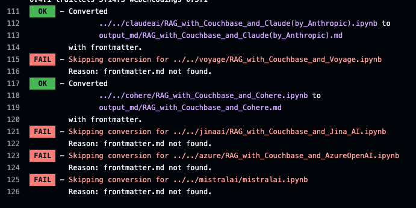
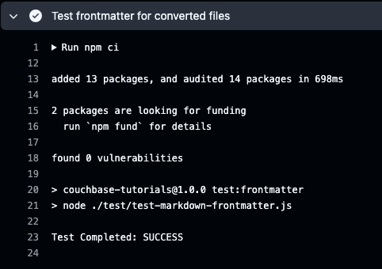
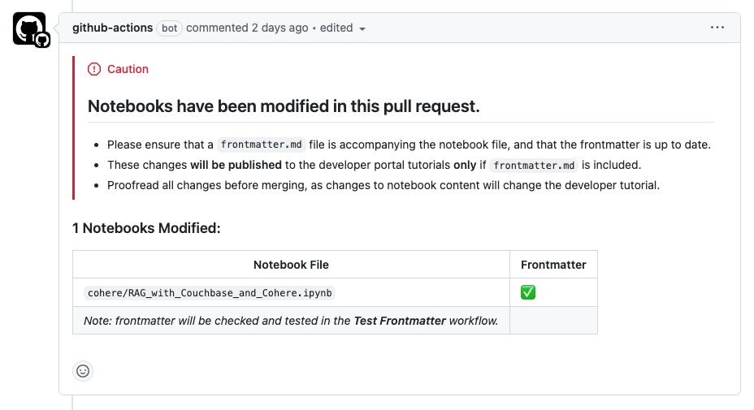

# Jupyter Notebooks to Markdown Conversion Tool

This utility includes tooling that automatically converts Jupyter Notebooks (`.ipynb` files) to markdown tutorials, and then commits and pushes them to `couchbase-examples/couchbase-tutorials` to be published to the developer portal tutorials.

## Features

- **Automatic Conversion**: Jupyter Notebooks are automatically converted to markdown files using [nbconvert](https://nbconvert.readthedocs.io/), via a python script `convert.py`.
- **Frontmatter Integration**: If a `frontmatter.md` file is present in the same directory as the notebook, its content will be prepended to the converted markdown file. If `frontmatter.md` is not present, the conversion will be skipped.
  - **PR Comment Automation**: A GitHub Action is set up to detect changes or additions of `.ipynb` files in pull requests. If any changes are detected, a comment is added to the PR to warn the author that their changes will be published, and that `frontmatter.md` is required.

## GitHub Actions

### Convert Notebooks
The **`convert-notebooks`** workflow automatically runs **when files are pushed to main** that modify `.ipynb` files. It handles the following steps:

1. Detect changes to `.ipynb` files.
2. Convert the modified notebooks to markdown.
3. Push the converted markdown to the `couchbase-examples/couchbase-tutorials` repository. They will be automatically built and published weekly.

### Test Convert Notebooks
The **`test-convert-notebooks`** workflow automatically runs on **pull requests** that modify `.ipynb` files. It handles the following steps:

1. Detect changes to `.ipynb` files.
2. Convert the modified notebooks to markdown.
3. Run the frontmatter tests from `couchbase-examples/couchbase-tutorials` to ensure the frontmatter is valid.

### Detect Notebook Changes
The **`detect-notebook-changes`** workflow automatically runs on **pull requests**. It handles the following steps:

1. Detect changes to `.ipynb` files.
2. Confirm that the `frontmatter.md` file exists for each notebook.
3. Add a comment to the pull request warning the user that changes will be pushed live when merged and reporting if any notebooks are missing the `frontmatter.md` file.

